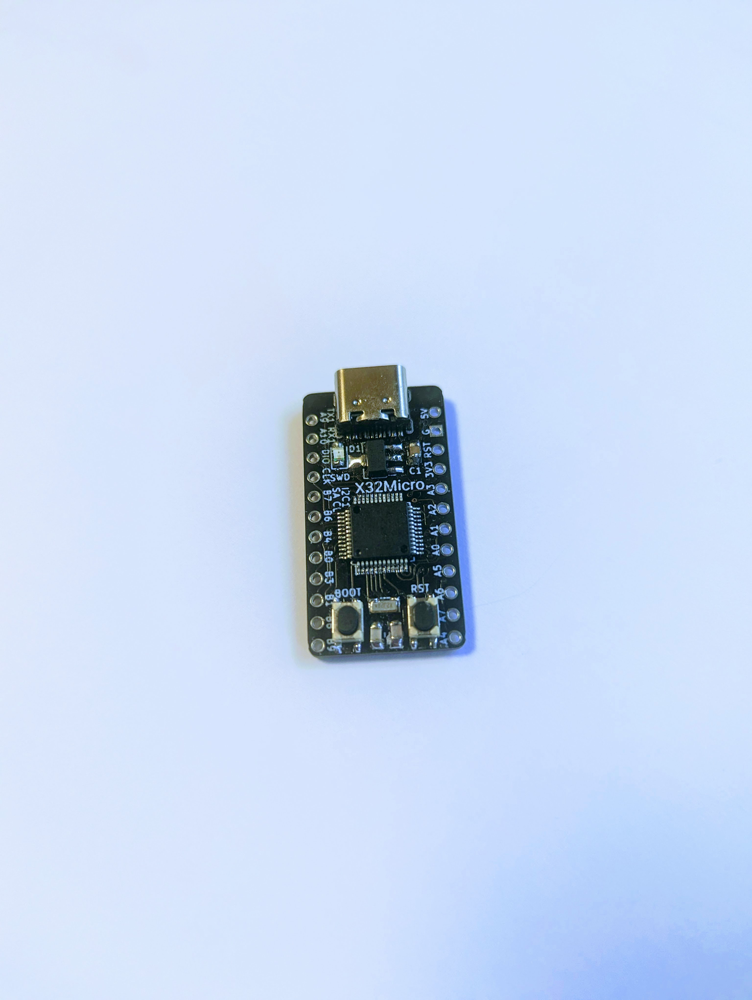
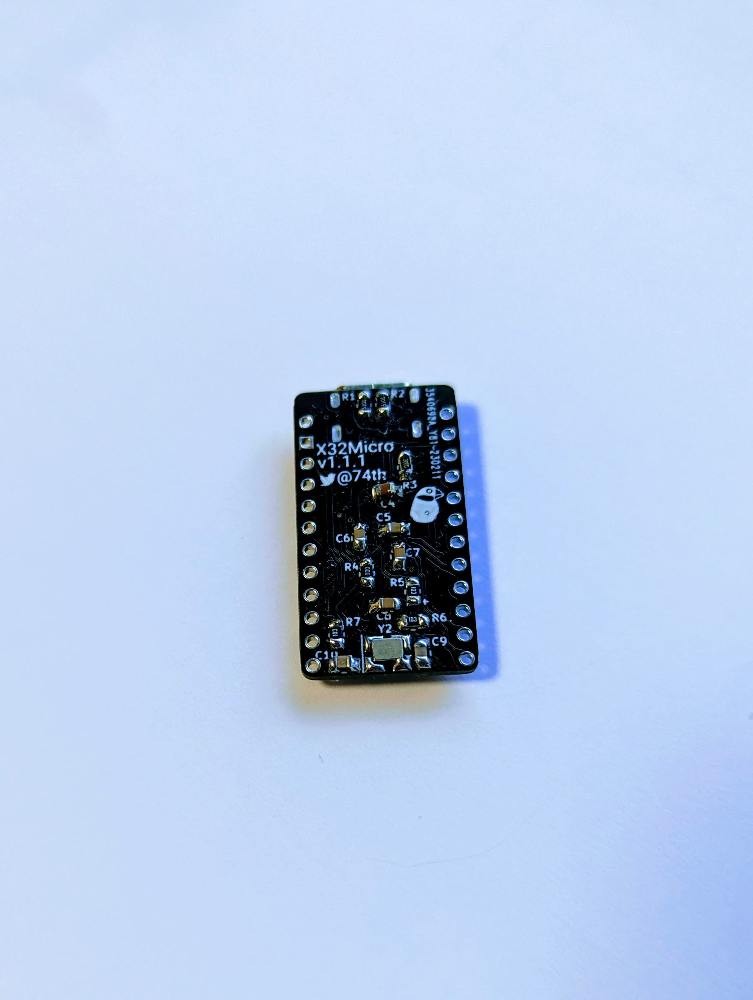
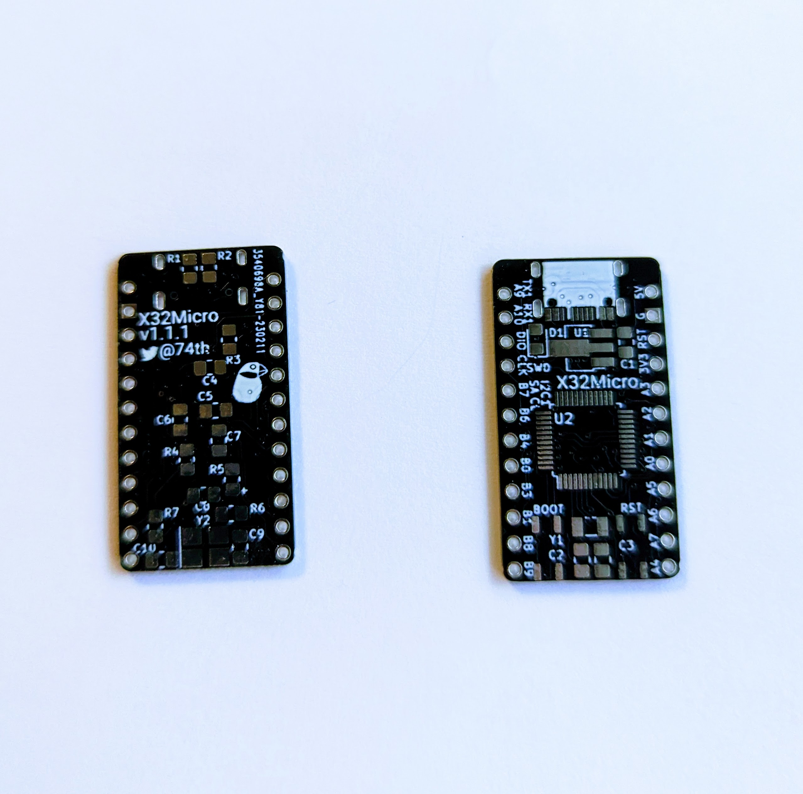

# x32micro - STM32F103CxT6, CH32V203C8T6 ProMicro size board

ProMicro サイズの STM32、CH32 など STM32F103CxT6 互換ピンアウト MCU 用 ProMicro 型開発ボード

  

- BOOTH 販売ページ
- 回路図 Semantics [documents/x32micro-v1.1.1-semantics.pdf](documents/x32micro-v1.1.1-semantics.pdf)
- PCB [documents/x32micro-v1.1.1-pcb.pdf](documents/x32micro-v1.1.1-pcb.pdf)

### Tested MCU

<!-- - STMicro: STM32F103C8T6 -->

- WCH: CH32V203C8T6

## X32Micro v1.1.1

### 部品表 Parts List

| Reference | Parts                                | Qty |
| --------- | ------------------------------------ | --- |
| R1,R2     | 0805 Register 5.1kR                  | 2   |
| R3        | 0805 Register 200R                   | 1   |
| R4        | 0805 Register 0R                     | 1   |
| R5,R6,R7  | 0805 Register 10kR                   | 3   |
| C1        | 0805 Capacitor 10uF                  | 1   |
| C2,C3     | 0805 Capacitor 12pF                  | 2   |
| C4        | 0805 Capacitor 2.2uF                 | 1   |
| C5-8      | 0805 Capacitor 100nF                 | 4   |
| C9,C10    | 0805 Capacitor 22pF                  | 2   |
| D1        | 0805 LED                             | 1   |
| Y2        | 3225 4Pin Crystal 8MHz               | 1   |
| Y1        | 3215 2Pin Crystal 32.768kHz          | 1   |
| U1        | SOT-89 3.3V 1A Regulator AMS1117-3.3 | 1   |
| U2        | MCU STM32V103C8T6                    | 1   |
| SW1,SW2   | Push Switch SKRPABE010               | 2   |
| J1        | USB 2.0 Type-C Socket                | 1   |

## License

MIT
