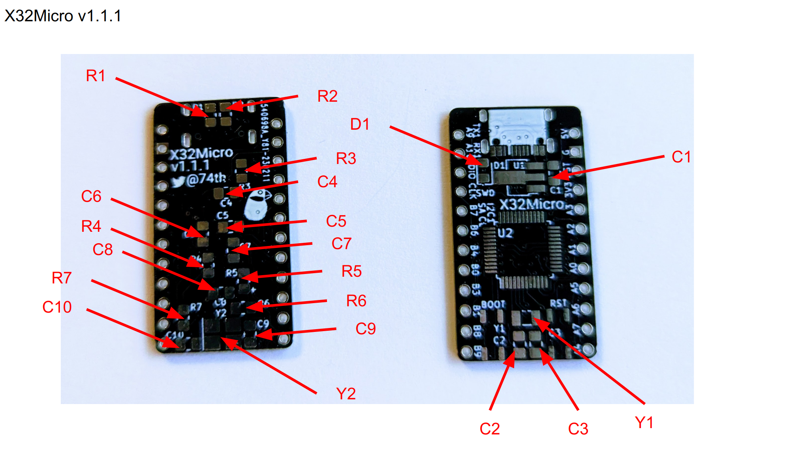

# x32micro - STM32F103CxT6, CH32V203C8T6 ProMicro size board

ProMicro サイズの STM32、CH32 など STM32F103CxT6 互換ピンアウト MCU 用 ProMicro 型開発ボード

  

- Shop Site (BOOTH 販売ページ)
  - [WCH CH32V203C8T6](https://74th.booth.pm/items/4492691)
  - [ST STM32V103C8T6](https://74th.booth.pm/items/4571728)

### Tested MCU

<!-- - STMicro: STM32F103C8T6 -->

- WCH: CH32V203C8T6
- STMicro: STM32F103C8T6

## X32Micro v1.2.0

### feature

difference from v1.1.1

- Arduino UNO R4-like SWD with UART 1.24mm 10-pin added. VCC is 3.3V.
- Added Fuse to power supply.
- Damping resistor added to USB DM/DP
- Added pull-up resistor on USB DP to indicate USB 1.1 Full Speed
- Omit the LowPower crystal (because the built-in RC clock can be used).
- Omitted the BOOT0 button (since it is rarely used) and added through-hole access to BOOT0 and 1
- Changed pin assignments

#### Japanese

- Arduino UNO R4 っぽい UART 付き SWD 1.24mm 10 ピンを追加。ただし VCC は 3.3V。
- 電源に Fuse を追加
- USB DM/DP にダンピング抵抗を追加
- USB DP に USB 1.1 Full Speed を示すプルアップ抵抗追加
- LowPower 用クリスタルを省略（内蔵 RC クロックが使えるので）
- BOOT0 ボタンを省略（滅多使わないので）して、BOOT0、1 をスルーホールでアクセスできるように
- ピン配置変更

### Documents

- Semantics : [PDF](f103cxt6/x32micro-v1.1.1-semantics.pdf) [kicanvas](https://kicanvas.org/?github=https%3A%2F%2Fgithub.com%2F74th%2Fx32promicro%2Fblob%2F1.2.0%2Fx32promicro.kicad_sch)
- PCB [kicanvas](https://kicanvas.org/?github=https%3A%2F%2Fgithub.com%2F74th%2Fx32promicro%2Fblob%2F1.1.1%2Fx32promicro.kicad_pcb)

### Parts List

| Designator | Name                                       | Quantity |
| ---------- | ------------------------------------------ | -------- |
| R1,R7      | Register 0805 10kR                         | 2        |
| R2,R3      | Register 0805 5.1kR                        | 2        |
| R4         | Register 0805 1.5kR                        | 1        |
| R5,R6      | Register 0805 27Ω                          | 2        |
| C1         | Capacitor 0805 10uF                        | 1        |
| C2,C4,C5   | Capacitor 0805 100nF                       | 3        |
| C3         | Capacitor 0805 2.2uF                       | 1        |
| C6,C7      | Capacitor 0805 10-22pF                     | 2        |
| F1         | Polyfuse 1206 Polyfuse                     | 1        |
| D1         | LED 0805 Blue                              | 1        |
| U1         | MCU STM32V103C8T6/CH32V203C8T6             | 1        |
| U2         | LDO Regulator SOT-89 AMS1117-3.3           | 1        |
| Y1         | SMD Crystal 3225 8MHz                      | 1        |
| SW1        | Button SKRPABE010                          | 1        |
| J1         | USB Type-C 2.0 Receptacle Molex 2171790001 | 1        |
| J2         | Pin Header 2x5 Pitch 1.27 mm               | 1        |

## X32Micro v1.1.1

[gerber](https://github.com/74th/x32promicro/releases/tag/1.1.1)

### Document

- 回路図 Semantics: [PDF](f103cxt6/x32micro-v1.1.1-semantics.pdf) [kicanvas](https://kicanvas.org/?github=https%3A%2F%2Fgithub.com%2F74th%2Fx32promicro%2Fblob%2F1.1.1%2Fx32promicro.kicad_sch)
- PCB [PDF](f103cxt6/x32micro-v1.1.1-pcb.pdf) [kicanvas](https://kicanvas.org/?github=https%3A%2F%2Fgithub.com%2F74th%2Fx32promicro%2Fblob%2F1.1.1%2Fx32promicro.kicad_pcb)

### 部品表 Parts List

CH32V203 はクリスタルなしでも動作します。
その場合 Y1、Y2、C2、C3、C9、C10 を未実装にしてください。

| Reference | Parts                                | Qty |
| --------- | ------------------------------------ | --- |
| R1,R2     | 0805 Register 5.1kR                  | 2   |
| R3        | 0805 Register 200R or 10kR           | 1   |
| R4        | 0805 Register 0R                     | 1   |
| R5,R6,R7  | 0805 Register 10kR                   | 3   |
| C1        | 0805 Capacitor 10uF                  | 1   |
| C2,C3     | 0805 Capacitor 12pF                  | 2   |
| C4        | 0805 Capacitor 2.2uF                 | 1   |
| C5-8      | 0805 Capacitor 100nF                 | 4   |
| C9,C10    | 0805 Capacitor 22pF                  | 2   |
| D1        | 0805 LED                             | 1   |
| Y2        | 3225 4Pin Crystal 8MHz               | 1   |
| Y1        | 3215 2Pin Crystal 32.768kHz          | 1   |
| U1        | SOT-89 3.3V 1A Regulator AMS1117-3.3 | 1   |
| U2        | MCU STM32V103C8T6                    | 1   |
| SW1,SW2   | Push Switch SKRPABE010               | 2   |
| J1        | USB 2.0 Type-C Socket                | 1   |

## License

MIT
